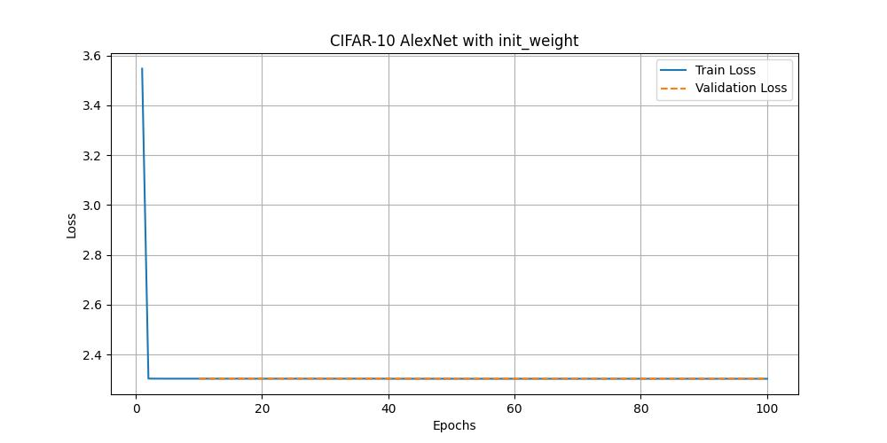
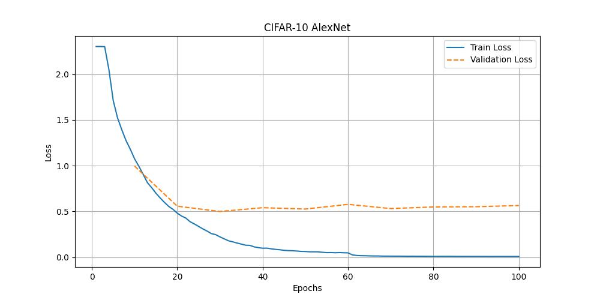
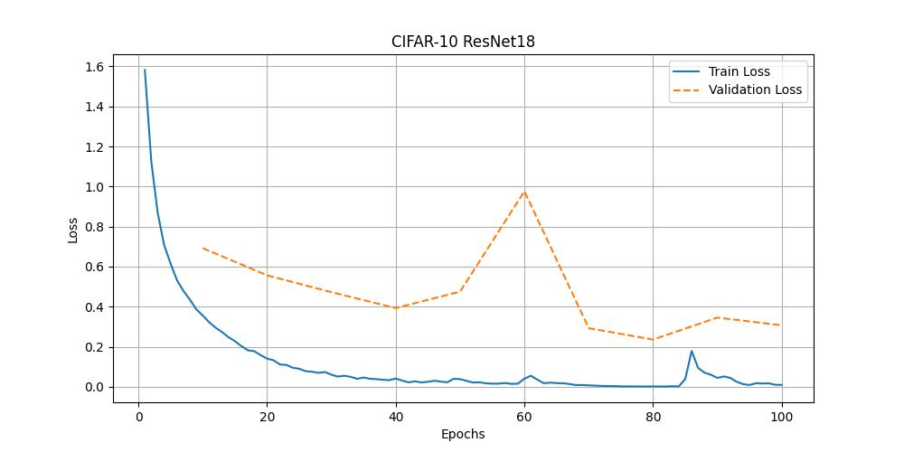

# AlexNet

This repository implements **AlexNet** and includes key insights and experimental results.  
Except for the dataset and multi-GPU training, all other experimental settings were kept identical to those in the original paper.

## Key Summary about AlexNet
- Utilizes the **spatial invariance** and **local dependencies** of CNNs, significantly reducing the number of parameters compared to fully connected networks while maintaining similar performance.
- **ReLU activation** increases training speed and mitigates the saturation problem without requiring input normalization.
- **Multi-GPU training** improves training speed and reduces the **Top-1 error rate by 1.7%** and the **Top-5 error rate by 1.2%**.
- **Local Response Normalization (LRN)** helps reduce the **Top-1 error rate by 1.4%** and the **Top-5 error rate by 1.2%**.
- **Overlapping pooling** mitigates the tendency for overfitting.
- **Dropout regularization** strengthens individual neurons by encouraging more robust feature learning, effectively reducing overfitting.


## Environment

### Software
- **Host OS**: Windows 11
- **CUDA**: 12.4

### Hardware
- **CPU**: AMD Ryzen 5 7500F 6-Core Processor
- **GPU**: RTX 4070 Ti Super
- **RAM**: 32GB

## Experiment Environment
- **Docker**: Ubuntu 22.04
- **Python**: 3.10.12
- **Libraries**: See `requirements.txt`

## Dataset
We used the **CIFAR10 Dataset**, which consists of:
- **Total images**: 60,000 (50,000 for training, 10,000 for testing)
- **Number of classes**: 10 (airplane, automobile, bird, cat, deer, dog, frog, horse, ship, truck)
- **Image size**: 32x32 pixels (RGB) 
- **Training Data Split**: 80% (train: 40,000) / 20% (validation: 10,000)
- **Test Data**: The full test dataset (10,000 images) was used without augmentation.

**Note**: The original paper used the **ILSVRC2012** dataset. However, due to its large size, we were unable to run it. Instead, we used CIFAR-10 while keeping the augmentation process identical to the original paper.

## Data Augmentation
- **Training and Validation Augmentations**:
  - **Resize**: Images are resized to 256×256 pixels.
  - **Random Crop**: A random 224×224 crop is taken from the resized image.
  - **Horizontal Flip**: Each image is duplicated, with one version flipped horizontally.
  - **Normalization**: Mean subtraction and standardization using mean `[0.485, 0.456, 0.406]` and standard deviation `[1, 1, 1]`.

- **Test Augmentations**:
  - **Resize**: Images are resized to 256×256 pixels.
  - **TenCrop**: Generates 10 cropped images of size 224×224.
  - **Horizontal Flip**: Each of the 10 cropped images is duplicated with a horizontally flipped version.
  - **Normalization**: Mean subtraction and standardization using mean `[0.485, 0.456, 0.406]` and standard deviation `[1, 1, 1]`.

## Experiment Settings
- **Optimizer**: SGD with momentum `0.9` and weight decay `0.0005`
- **Loss Function**: Cross-Entropy Loss (CELoss)
- **Model Parameters**: AlexNet has approximately **58,000,000 parameters**.
- **Learning Rate**: Configured via `cfg['train']['lr']`. The same learning rate was used for all layers, and it was manually adjusted during training. Our heuristic was to reduce the learning rate by a factor of 10 when the validation error rate stopped improving at the current learning rate.
- **Hyperparameters**: See `conf/config.yaml` for details.

## Experiment Results

### With Weight & Bias Initialization

```
Top-1 Error: 0.9000 | Top-5 Error: 0.5000
```
Following the original paper, we initialized the deflection of the hidden layer fully connected to the second, fourth, and fifth convolutional layers to a constant value of 1. The deflection of all the other layers was initialized to zero. However, as you can see from the graph, the model does not converge properly. I doubt that I did the wrong implementation or if it is an unsuitable method for CIFAR-10's dataset.

### Without Weight & Bias Initialization  
  
```
Top-1 Error: 0.1397 | Top-5 Error: 0.0072
```
Compared to the initialized model, the model without weight and bias initialization exhibits better convergence behavior. However, despite its improved training performance, we observed signs of overfitting after only a few epochs. This suggests that the AlexNet architecture may be too large for the relatively small CIFAR-10 dataset, leading to poor generalization.

### ResNet18
  
```
Top-1 Error: 0.0970 | Top-5 Error: 0.0044
```
To further investigate this hypothesis, we conducted an additional experiment using ResNet18, which has approximately three times fewer parameters than AlexNet. As shown in the graph, ResNet18 exhibits a more stable training process, suggesting that a smaller model is better suited for this dataset. The results highlight the importance of choosing an appropriate model size relative to the dataset size to prevent overfitting and improve generalization.

### Key Findings & Takeaways
- **Weight & Bias Initialization Matters**: Initializing the biases of certain layers with a constant value of 1, as suggested in the original paper, led to poor convergence in our experiments with CIFAR-10. This suggests that such an initialization strategy might not generalize well to datasets significantly different from ImageNet.

- **AlexNet Struggles with CIFAR-10**: While AlexNet was originally designed for large-scale datasets like ImageNet, its performance on CIFAR-10 indicates that it may be overparameterized for such a small dataset. The model tended to overfit quickly, leading to suboptimal generalization.

- **ResNet18 Shows Better Generalization**: ResNet18, with significantly fewer parameters than AlexNet, demonstrated improved training stability and lower error rates on CIFAR-10. This suggests that modern architectures leveraging residual connections are better suited for small-scale datasets.

- **Data Augmentation is Essential**: Without strong data augmentation techniques, both AlexNet and ResNet18 showed signs of overfitting. Techniques like random cropping, horizontal flipping, and normalization played a crucial role in improving generalization.

- **Learning Rate Scheduling Improves Convergence**: Manually adjusting the learning rate, specifically reducing it by a factor of 10 when the validation error plateaued, was crucial in achieving better performance.

- **Future Work**: Given the limitations observed with AlexNet on CIFAR-10, future work could explore:
  - Training on a larger dataset such as **TinyImageNet** to better evaluate AlexNet’s performance.
  - Implementing **alternative normalization techniques** like **Batch Normalization** instead of Local Response Normalization (LRN).
  - Experimenting with **lighter architectures** such as **MobileNet** or **EfficientNet** to compare efficiency and accuracy trade-offs.

## How to Run the Experiment

1. Clone the repository:
   ```sh
   git clone https://github.com/your-repo-name.git
   cd your-repo-name
   ```
2. Install dependencies:
   ```sh
   pip install -r requirements.txt
   ```
3. Run the training script:
     ```sh
     python train.py
     ```
4. View results:
   - check **/outputs** folder (It is automatically generated when script is executed.)